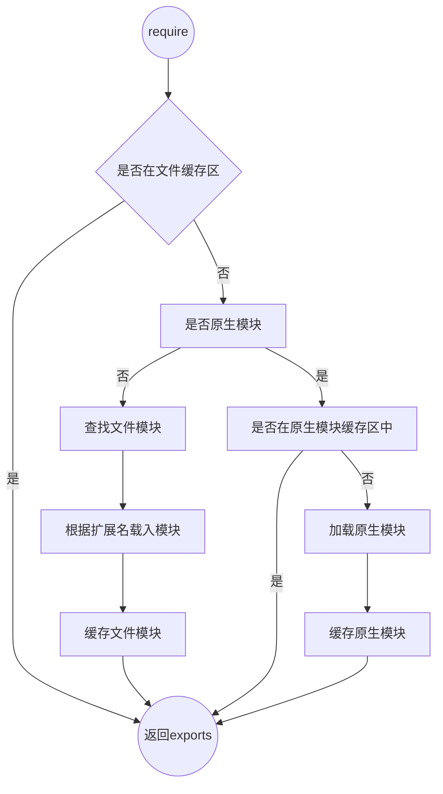

### NodeJs 模块加载
 <!-- more -->

```mermaid
  graph TD
    B((require)) -->C{是否在文件缓存区}
    C -- 是 -->AA((返回exports))
    C -- 否 -->E[是否原生模块]
    E -- 是 -->F[是否在原生模块缓存区中]
    E -- 否 -->I[查找文件模块]
    I --> J[根据扩展名载入模块] --> K[缓存文件模块]
    K --> AA((返回exports))
    F -- 是 --> AA((返回exports))
    F -- 否 --> G[加载原生模块]
    G --> H[缓存原生模块]
    H --> AA((返回exports))
``` 